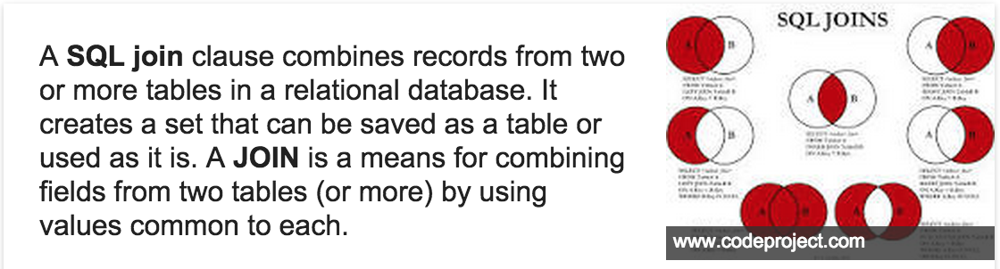

##Objective: You are going to build an ORM, which stands for <a href="http://en.wikipedia.org/wiki/Object-relational_mapping">Object Relational Mapper</a>. ORM's are super powerful tools that abstract away raw SQL statements, giving you access to methods for searching, sorting, associating, just to name a few. Ruby on Rails is powered by an ORM called Active Record, which is what makes Rails so awesome. The overall goal is to gain an understanding of an ORM and an appreciation of the abstraction that is provided.

Right now your ORM Student class has methods that will:

1. Insert students into the database with their associated attributes.
2. Update a student's attributes in the database and have it persist(continue to exist).
3. Delete students from the database.
4. Create a new instance of a student from the database.(Students will exist in the database in a row, you will create an instance (object) so you can use that object.)
5. Find a student by their name or id.
6. Add a course to a student.

After completing this lab, your Course, Department and Registration classes will have similar functionality. In order to make them talk to each other, you will have to use <a href="http://www.sql-join.com/">SQL joins</a> 
 

For example, you will be able to find all courses by department and let students register for classes.

Use your Student class and the specs as a guide to complete the lab.

